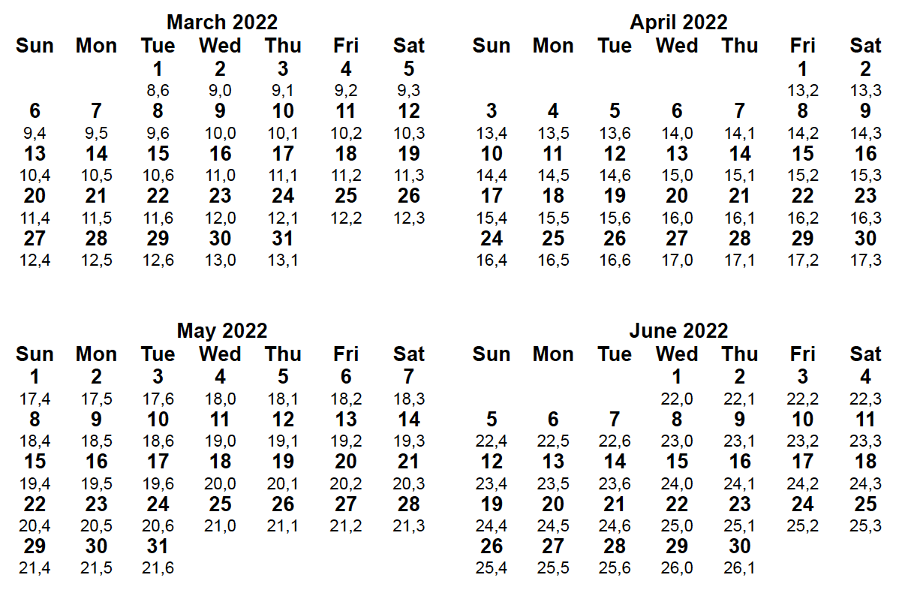

# Pregnancy week calendar

Generates a pretty printable HTML calendar file with week+day per day.



1. Install the requirements (preferably in a virtual env):

```pip install -r requirements.txt```

2. Set the following variables in `cal.py` to a specific day:
* `GIVEN_WEEK`
* `GIVEN_DAY`
* `GIVEN_DATE`

3. run
`python3 cal.py`

**Warning**: There are a few bugs since I didn't try different inputs, so please verify and fix if needed.
